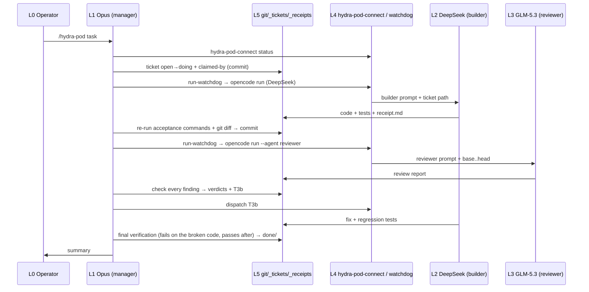

# 11. Report on the workflow between layers and coordination between agents

> Date: 2026-09-26.
> Source: everything in `~/om-sandbox` (the validation sandbox project, not included in this repository), which is 5 tickets, 24 commits and 7 logged runs (jsonl), in addition to the `~/Hydra-Pod` code.
> Every number in this report is measured from these files, not estimated.

## Summary

The three layers (manager, builder, reviewer) **now work as a single system with trustworthy results**. The evidence:

- In all five tickets the builder passed acceptance on the first attempt, and did not touch any file outside the scope.
- The reviewer found the seeded regression in all three reviews that contained one.
- The manager did not pass through any finding without checking it, and thanks to that caught an error in a fix proposed by the reviewer.

**But coordination is still manual at the handoff points.** Context passes from one layer to another as free text, not as a fixed contract. Three gaps cost time and quota, and their impact repeats in every ticket:

1. The reviewer cannot verify its claims by running them. As a result, 23 out of 61 of its tool calls were rejected.
2. The reviewer lacks essential context: who makes the commits, what the current time is, and which commands are allowed. As a result, incorrect "UNSURE" findings.
3. There is no shared machine-readable state. Each ticket's state is spread across git, files and memory.

Section 7 proposes a unified handoff contract that addresses all three, ordered by priority.

---

## 1. The layers

| # | Layer | Who runs it | Responsibility | Boundaries |
|---|---|---|---|---|
| L0 | Human | L0 Operator | Decisions: who sees the code, approval of `--auto`, the device login, and sign-off on the outputs | Nothing is asked of the operator except what the machine cannot do: an approval, a decision, or a login |
| L1 | Manager and verifier | Opus 5.5 inside Claude Code (`/hydra-pod`) | Planning, writing tickets, dispatch, acceptance, checking findings, fix tickets, final verification, and the commits | Does not write the implementation code |
| L2 | Builder | DeepSeek V4.1 Flash via `opencode run --auto` | Writes the code and the tests within the ticket's scope, runs the acceptance commands, and writes the receipt | Does not commit, does not move tickets, and does not go outside the allowed files |
| L3 | Reviewer | GLM-5.3 via opencode (`--agent reviewer`) or ZCode (`hydra-pod-connect review`) | Reads the diff and the code, looks for errors and regressions, and writes the report | Modifies nothing. The tools enforce this, not the model's compliance |
| L4 | Runtime and accounts | `hydra-pod-connect`, `run-watchdog.sh`, `zcode-review-prep.sh`, and `zai-quota.sh` | Connecting accounts, checking connectivity, non-interactive execution, retries, and preparing the review context | Does not read credentials, and does not make decisions |
| L5 | Shared state | git, `_tickets/`, `_receipts/`, and `workers.md` | The only shared memory between the agents: the ticket, the receipt, the review report, the verdicts, and the history | Free text. Nothing in it is machine-readable except git |

**The agents do not communicate directly.** All coordination passes through L5 (files and git), and L1 is the only one that reads and writes in every direction. This is a sound design: the roles are separate, and every handoff leaves a reviewable artifact. But it means the entire quality of coordination equals the quality of what L1 writes into the files.

---

## 2. The workflow inside each layer

### L1: Manager (Opus)

| Stage | What it does | Evidence from the tickets |
|---|---|---|
| planning | Writes a ticket containing: the goal, the allowed files, the specification, the acceptance commands, and a "Why these checks" paragraph | T1 through T3b all follow the same template |
| lock and claim | `git mv open→doing` and a `claimed-by` line, then a commit | commits of the form `claim for …` |
| dispatch | The command from `workers.md` via the watchdog | 5 builder runs, all on the first attempt |
| acceptance | Re-runs every acceptance command, reviews the `git diff`, and reads the open questions | In all five cases the output matched the receipt |
| review dispatch | Determines the `base..head` range and the context | 4 reviews (T1, T2, and T3 twice) |
| checking findings | Reproduces every finding in the code, then judges: correct, partially correct, or incorrect | 13 findings: 11 correct, 1 partially correct, 1 incorrect, and **a wrong proposed value discovered (T2)** |
| fix | A fix ticket containing only the corrected values | T2b and T3b |
| final verification | Re-runs the checks, confirms that the regression test **fails on the broken code**, and compares `src` with the builder's version | T2b: `src` = `33818a1`. T3b: `src` = `d3ce09b` |

### L2: Builder (DeepSeek)

| Run | Duration | Tool calls | Rejected | Files outside scope |
|---|---|---|---|---|
| T2-min-length | 41 s | 18 | 0 | 0 |
| T2b-fix-tokenization | 63 s | 19 | 0 | 0 |
| T3-stopwords | 39 s | 14 | 0 | 0 |
| T3b-fix-tie-order | 57 s | 18 | 0 | 0 |

(T1 and the setup trial ran before `--format json` was adopted, so they have no event log. T1's duration was 26 s with 11 tool calls.)

- **Behavior inside the layer is excellent:** no rejections, no going outside the scope, and useful open questions. One example is the Unicode length question in T2, which later became a finding for the reviewer.
- **One note:** in T3b it named the tests itself because the ticket did not specify their names, and mentioned that in the open questions. This is correct behavior.

### L3: Reviewer (GLM-5.3)

| Review | Path | Duration | Calls | **Rejected** | Found the seeded regression | Incorrect findings |
|---|---|---|---|---|---|---|
| T1 | opencode | 95 s | 13 | 5 | (no seeded regression) PASS | 0 |
| T2 | opencode | 207 s | 20 | 7 | ✅ high | 0 (one with a wrong proposed value) |
| T3 | opencode | 271 s | 28 | **11** | ✅ high | 1 |
| T3 | ZCode | 98 s | not logged | 0 (the tools do not exist at all) | ✅ HIGH | 0 |
| T2 (phase 4 trial) | ZCode | 155 s | not logged | 0 | ✅ high | 0 (one partially correct) |

**All the rejected calls on the opencode path (23 of 61) are of two kinds:**

- **Attempting verification by running code:** `python3 -c "… top_words(…)"`, a python heredoc, and `printf … | python3`. The reviewer wants to prove its examples. The allowlist prevents that, and this is right security-wise because python can write. So it writes in its report "derived from semantics, runtime confirmation was not possible".
- **`date`:** to know the time and write it on the first line of the report. It was rejected in every review.

**The test commands themselves were sometimes rejected** when the reviewer appended `| tail -5` to them, because `tail` is not allowed. That is, the reviewer was blocked even from the command we asked it to run.

### L4: Runtime and accounts

| Component | Function | What happened in practice |
|---|---|---|
| `hydra-pod-connect status/test` | Checks the accounts before dispatch | Works. `status` does not consume quota |
| `hydra-pod-connect connect` | The official device login from the browser | Works. Its weakest point is the **timing of human approval (L0)**, as the link expired 7 times |
| `run-watchdog.sh` | Retries if no event arrives within 90 s | After the stdin fix, every run succeeded on the first attempt |
| `zcode-review-prep.sh` | Prepares the diff, the commit list, and a request with absolute paths | Works, and took a snapshot when the tree differed |

### L5: Shared state

- **Sources of truth:** git, the ticket's location (`open`, `doing`, `done`), and `claimed-by`.
- **The ticket's full artifact trail:** the ticket, the receipt, the run log, and the review report with the manager's verdicts at its end.
- **What is missing:**
  - A single file that answers "where is every ticket now, and what comes next?".
  - An automatic link between the ticket and the commit range (`base..head`). This link is computed by hand every time.

---

## 3. Handoffs between layers

| # | From → To | Transferred artifact | Implicit contract | How it is verified | What was observed |
|---|---|---|---|---|---|
| H1 | L0 → L1 | `/hydra-pod <task>` | The task, and the privacy and `--auto` decisions in `workers.md` | The skill asks on first use | Works |
| H2 | L1 → L4 | `hydra-pod-connect status` | The required accounts are connected | Status per provider | Works. On disconnection the command goes to L0 |
| H3 | L1 → L2 | A `doing/` ticket + the fixed builder prompt | The scope, the acceptance commands, and the "why" | Nothing before the run | **Works flawlessly in 5 of 5** |
| H4 | L2 → L1 | The receipt (`receipt.md`) + the run log | A claim of the raw output | L1 re-runs every command | Matched in 5 of 5 |
| H5 | L1 → L3 | The reviewer prompt + `base..head` + the ticket and receipt paths | What is reviewed, and what it is allowed to do | Nothing. The context is free text | **The main weak point** (Section 4) |
| H6 | L3 → L1 | A report in a fixed format (first line, verdict, findings) | Claims. UNSURE is tagged | L1 reproduces every finding | Works, and caught the T2 error |
| H7 | L1 → L2 | A fix ticket (`T<N>b`) with the corrected values | Only the correct findings, with their correct values | The same acceptance + the test failing on the broken code | Works in 2 of 2 |
| H8 | L1 → L5 → L0 | A commit, a move to `done/`, and a summary | The artifact is complete | git | Works |

### Sequence diagram of a complete ticket (T3)



---

## 4. The gaps that prevent working as a single entity

### G1: The reviewer has no safe verification channel (H5 and H6)

- **Evidence:** 23 of 61 reviewer tool calls were rejected, most of them `python3 -c` attempts to prove an example. In T3 alone, 11 of 28 calls were rejected, and the review duration was 271 s.
- **Impact:**
  - Wasted time and quota.
  - Reports that say "I could not confirm".
  - Conversely, the manager reproduces every example itself during checking, meaning **the work is duplicated across two layers**.
- **Why not simply allow `python3`:** because python can write to any path, so the read-only guarantee collapses.

### G2: Missing context in the review request (H5)

- **Evidence:**
  - The finding "the commits contradict the ticket" appeared twice (T2 via ZCode, and T3 via opencode), because the reviewer does not know that the manager is the one who makes the commits. The sentence was added to the ZCode prompt, but not to the default opencode prompt in `prompts/reviewer.md`.
  - `date` was rejected in every review because the prompt does not give the time.
  - `| tail` was rejected because the prompt does not say "run this command exactly".
- **Impact:** incorrect UNSURE findings, and more rejected calls.

### G3: No machine-readable handoff contract (L5)

- **Evidence:**
  - The range of every review (`bb7e89d..f744f60`) was computed by the manager by hand from `git log`.
  - The acceptance commands are written in the ticket as text, and the manager retypes them at every acceptance.
  - There is no single state file for the tickets.
- **Impact:** every handoff depends on the manager's manual accuracy, and any copy error passes silently.

### G4: The human on a time-critical path (L0 with L4)

- **Evidence:** 7 expirations of approval links, because the manager's messages do not reach the operator while the tool is waiting, and `!` was sent as text when preceded by a space.
- **Impact:** the ZCode review in phase 6 was delayed by about 40 minutes.

### G5: No unified cost measurement

- **Evidence:**
  - The Z.ai quota was measured only for ZCode reviews (15 and 10 units), and was not measured for the opencode path.
  - OpenCode Go consumption was not measured.
  - Claude Pro consumption was not measured.
- **Impact:** the question "which path is cheaper per ticket?" cannot be answered with numbers.

---

## 5. What already works as a single entity

- **Strict separation of roles enforced by the tools:**
  - The builder does not commit, and the receipts confirm this.
  - The reviewer does not modify, and this is proven by the forced-write experiments on both paths.
- **Multi-layer defense against error:** the builder's error is caught by the reviewer, and the reviewer's error is caught by the manager. Both actually happened:
  - The seeded regression in T2 and T3 was found by the reviewer.
  - The wrong proposed value in T2 was found by the manager.
- **Minimal-change fix:** after T2b and T3b the `src` code became **exactly identical** to the builder's original version, and no trace of the error leaked into the code.
- **Regression tests are real:** every test added in a fix ticket was proven to fail on the broken code.
- **Two compatible reviewers:** on T3 both paths agreed on every correct finding, which is evidence that layer L3 is stable and does not depend on one particular tool.

---

## 6. Aggregate measurements

| Metric | Value |
|---|---|
| Tickets closed | 5 (T1, T2, T2b, T3, T3b) |
| Builder success on the first attempt | 5 of 5 |
| Average run duration (with an event log) | 50 s (between 39 and 63) |
| Seeded regression caught by the reviewer | 3 of 3 reviews (T2, and T3 via both paths) |
| Accuracy of review findings (13 findings in 4 reviews containing a seeded regression, opencode + ZCode) | 11 correct, 1 partially correct, 1 incorrect |
| Rejected reviewer calls (opencode) | 23 of 61 (38%) |
| Human interventions required per ticket | 0 after the initial setup (except signing in again) |

---

## 7. Recommendations: a unified handoff contract

Ordered by impact versus effort. **All the recommendations were implemented on 2026-09-26: R1 (Section 7a), R2, R3 and R4 (Section 7b), and R5 and R6 (Section 7c).**

### R1 (high impact, low effort): a fixed context block in every review request

It is added to `prompts/reviewer.md` and to `prompts/reviewer-zcode.md`:

```text
Context: commits in the range were made by the manager after acceptance, not by the worker.
Current time: <ISO time>. Do not run `date`.
You cannot execute Python or ad-hoc commands. Run the test command exactly as given, without pipes.
When you want a runtime check, do not attempt it: add a line `PROBE: <python expression> => <expected>`
under the finding. The manager runs every PROBE and records the result.
```

- **Addresses:** G1 and G2.
- **Expected impact:** rejected calls drop from 38% to near zero, and runtime verification becomes an organized task the manager performs instead of rejected attempts. This is the meaning of a "single entity": the reviewer proposes the evidence, and the manager runs it.

### R2 (high impact, medium effort): structured front matter for the ticket and the receipt

```yaml
---
ticket: T3-stopwords
state: doing            # open | doing | review | fixing | done
base: bb7e89d           # the commit before the run (the manager fills it in at claim time)
head: d3ce09b           # the acceptance commit (the manager fills it in)
acceptance:
  - python3 -B -m unittest discover -s tests -v
  - python3 -B -c "..."
allowed_files: [src/sandbox/textutil.py, tests/test_textutil.py]
reviewers: [opencode-glm, zcode]
---
```

- **Addresses:** G3.
- **Expected impact:**
  - The review range is computed automatically.
  - The acceptance commands are re-run automatically.
  - The diff is checked against `allowed_files` automatically.
  - Every ticket gets one clear state.

### R3 (medium impact, medium effort): the `hydra-pod-dispatch` command

A single command that links the layers: `hydra-pod-dispatch build|review|accept <ticket>`. It uses the structured front matter and runs the following:

1. `hydra-pod-connect status`, and stops work if the account is disconnected.
2. Lock and claim.
3. The watchdog.
4. Re-run the acceptance commands.
5. Check the allowed files.
6. Prepare the review: diff, the R1 context, and the time.

- **Addresses:** G3, and reduces the manager's manual work.
- **What remains for the manager:** judgment alone (planning, checking findings, and fixing), which is what the framework was designed to spend Claude's quota on.

### R4 (medium impact, low effort): a single state file

`_tickets/STATE.md` is generated from the ticket front matter: a table with every ticket, its state, its range, its last artifact, and the next step.

- **Addresses:** G3.
- **Expected impact:** the manager in a new session knows where the work stopped without re-reading everything.

### R5 (medium impact, low effort): taking the human off the critical path

- `hydra-pod-dispatch` checks the accounts **before** starting any ticket, and asks for reconnection at the beginning, not in the middle of the review.
- The instructions mention `hydra-pod-connect connect` in an isolated terminal window first, because that is the method that worked.

### R6 (low impact, low effort): a cost log

- `zai-quota.sh` before and after every review, written into the receipt.
- The duration and the number of calls per run are extracted automatically from the jsonl, as in the tables of this report.

- **Addresses:** G5.

---

## 7a. Result of implementing R1 (measured)

**What was added:**
- The fixed context block in `prompts/reviewer.md` and in `prompts/reviewer-zcode.md`.
- Automatic filling of the time and the previous specification in `zcode-review-prep.sh`.
- `scripts/probe-run.py`: it prints first, then runs (with `--run`) in a temporary copy of the project, and rejects any dangerous expression.

**Measurement method:** the same reviewer (GLM-5.3 via opencode), on the same T3 range (`bb7e89d..f744f60` with the seeded regression), in an isolated copy of the project:

| Metric | Before R1 | After R1 |
|---|---|---|
| Duration | 271 s | **71 s** |
| Tool calls | 28 | **11** |
| Rejected calls | 11 | **0** |
| Found the seeded regression | ✅ high | ✅ high |
| Incorrect findings | 1 (the manager's logs were counted as violations) | **0** (the reviewer explicitly stated they were the manager's work) |
| Runtime evidence | "I could not confirm" | **4 PROBE lines**, run by the manager: all four failed on `f744f60` and passed on the fixed code. **Every expected value proposed by the reviewer was correct** |

**Conclusion:** runtime verification now happens through the channel dedicated to it. The reviewer proposes the evidence, and the manager runs it once. The rejected attempts are gone, and the review duration fell to about a quarter.

## 7b. Result of implementing R2, R3 and R4 (measured)

**What was added:**
- `hydra_pod/ticket.py`: the structured front matter, with validation.
- `hydra_pod/dispatch.py` and `bin/hydra-pod-dispatch`: the claim, build, accept, review, probes, close and status commands.
- `templates/project/_tickets/TICKET.template.md`.
- `_tickets/STATE.md`: generated automatically, and excluded from git.
- **What was partially implemented:** from R5, that `build` and `review` stop if the account is not connected. And from R6, that the duration, the number of calls and the rejected ones are printed for every run.

**The first complete ticket with hydra-pod-dispatch (T4-unique-words):**

| Step | Result |
|---|---|
| claim | The new ticket was committed automatically, and `base=ddd1eb4` |
| build | 33 s, 13 calls, 0 rejected. The scope is clean, and the receipt is present |
| accept | Both acceptance commands passed (one by matching `==>`), and `head=6b7c294` |
| review | The request was built from the front matter. 58 s, 10 calls, **0 rejected**, PASS with no findings |
| Opus verification | The three mutations (`split(' ')`, ordering by first appearance, and not lowercasing) each fail at least one test |
| close + status | `STATE.md` shows the six tickets, and the state of old tickets without front matter is inferred from their folder |

**What changed in the manager's work:** it no longer computes `base..head` by hand, no longer copies the acceptance commands, and no longer builds the review request itself. Four moments of judgment remain: writing the ticket, reading the diff, judging the findings, and the fix ticket.

## 7c. Result of implementing R5 and R6 (measured)

**R5: the preflight (`hydra-pod-dispatch preflight`), run automatically by `claim`**

Before any work starts, it checks six things, without consuming any model's quota:

- The ticket front matter is valid.
- There are no uncommitted changes in the working tree.
- The builder's account is connected.
- The account of every reviewer listed in `reviewers:` is connected.
- The Z.ai balance is sufficient. The minimum is `HYDRA_POD_MIN_ZAI_CREDITS` (100 by default), measured on the tightest window.

If any check fails, `claim` stops before moving the ticket, and states the required command with a reminder that the connection is made **from an isolated terminal window**. This is the solution to the approval-expiry problem.

**Live trial:**
- The normal case passed, and the six checks were `ok`.
- The threshold was raised to 5000, so `claim` stopped and the ticket stayed in `open`.

**R6: the cost log**

Every `build` or `review` run adds a line to `_receipts/<ticket>.costs.jsonl`, containing:

- The duration, the number of calls, and the rejected ones.
- The tokens, taken from `step_finish` events in opencode, or from `usage` in ZCode.
- The catalog estimate in dollars (`cost` in opencode).
- The Z.ai balance consumed, computed from two quota snapshots before and after the run.

`hydra-pod-dispatch costs` shows the table and the totals, and `STATE.md` shows the number of runs, the tokens and the balance for each ticket.

**The first ticket with two reviewers and a cost log (T5-longest-word):**

| Stage | Provider | Duration | Calls | Rejected | Input/output tokens | Z.ai balance | Catalog estimate |
|---|---|---|---|---|---|---|---|
| build | opencode-go | 36 s | 12 | 0 | 21,048 / 3,058 | — | $0.0059 |
| review | opencode / zai-coding-plan | 122 s | 9 | 0 | 14,755 / 218 | 19 | $0 |
| review | zcode-lite | 77 s | — | — | 64,591 / 5,136 | 11 | — |

**Reading notes:**
- **The Z.ai balance is shared:** it is measured at the level of the whole account, so any concurrent use from another tool on the same account (other tools sharing the same Z.ai account, or ZCode) is counted within it. The number is an approximate upper bound, not exact.
- **The catalog estimate for OpenCode Go is informational only:** Go is a monthly subscription, and is not charged to the operator at the catalog price.
- **ZCode's tokens are higher:** ZCode consumed about four times more tokens than opencode, because it reads the diff and the files in full and cannot run git. Nevertheless it was faster on this ticket.
- **A defect that appeared and was fixed during the trial:**
  - **What happened:** an opencode review finished its report in full, then the connection to the model provider dropped (`ECONNRESET`), so opencode exited with code 1.
  - **The fix:** a complete report, that is one containing `Reviewer:`, is now accepted with a warning. An incomplete report still counts as a failure. Two tests were added for this.

## 8. Conclusion

- **The results are sound:** the framework meets its core goal. Every error, whether deliberately seeded or made by a model, was caught before reaching the final code, and every role stayed within its boundaries.
- **What separates it from working as one integrated entity is the handoffs:** context passes as free text and is computed by a human hand or by the manager, and the reviewer is left without a verification channel.
- **The first step:** R1 alone addresses the largest measured waste (38% of reviewer calls), by editing only two texts.
- **The next steps:** R2 and R3 turn the handoffs from manual work into an automatic contract.
